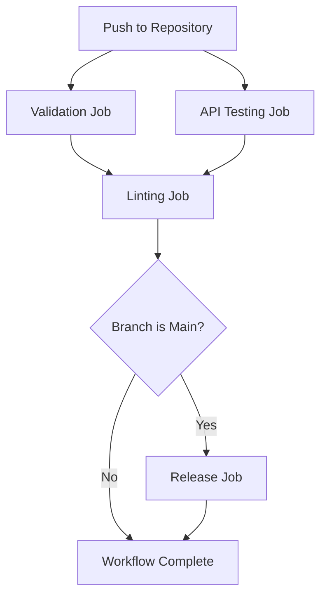

<div align="center">
  <h1>Workflow Documentation</h1>
  <p>Continuous Integration Process for NuraShade Weather Measures</p>
</div>

## 🔄 Overview

This document describes the automated workflow process for the NuraShade Weather Measures project. The workflow ensures code quality, validates functionality, and automates releases.

## 🚀 GitHub Actions Workflow

The project uses GitHub Actions for continuous integration with the following jobs:

### 1. Validation Job (`validate`)

This job validates the integrity and completeness of all weather measure files:

- **Current Forecast Validation**: Checks for presence of essential measures like temperature, weather code, and day/night indicators
- **7-Day Forecast Validation**: Verifies daily forecast measures including dates, temperatures, and weather conditions
- **7-Hour Forecast Validation**: Ensures hourly forecast measures are properly configured

### 2. API Testing Job (`test-api`)

This job tests connectivity and functionality of the Open-Meteo API endpoints:

- Tests current weather endpoint accessibility
- Validates daily forecast endpoint response
- Checks hourly forecast endpoint availability

### 3. Linting Job (`lint`)

This job performs code quality checks and identifies potential issues:

- Syntax validation for unmatched brackets
- TimeStampFormat validation to prevent parsing errors
- WMO weather code mapping verification (specifically code 3 → Overcast.png)

### 4. Release Job (`release`)

This job creates packaged releases when changes are pushed to the main branch:

- Packages all weather measure files into a distributable ZIP
- Creates a GitHub release with version tagging
- Attaches the packaged assets to the release

## 📊 Workflow Visualization



## 🛠 Configuration Details

### Trigger Events

The workflow is triggered on:
- Push events to `main` or `develop` branches (excluding markdown and license files)
- Pull requests to `main` or `develop` branches (excluding markdown and license files)

### Validation Process

Each validation step checks for:
1. Presence of parent WebParser measures
2. Essential child measures for each forecast type
3. Proper measure configuration

### API Testing

API tests verify:
- Endpoint accessibility
- Response validity
- Service availability

### Linting Checks

Linting includes:
- Bracket matching validation
- TimeStampFormat pattern checking
- WMO code mapping verification

## 📦 Release Process

When code is merged to the main branch:
1. All weather measure files are packaged
2. Documentation and license files are included
3. A version-tagged release is created
4. The package is attached as a release asset

## 🧪 Manual Testing Workflow

For manual testing of the weather measures:

1. **Configure Location**:
   ```
   [Variables]
   Latitude=YOUR_LATITUDE
   Longitude=YOUR_LONGITUDE
   ```

2. **Test Individual Measures**:
   - Load each `.inc` file separately in a test skin
   - Verify measure values update correctly
   - Check for parsing errors in Rainmeter log

3. **Validate API Responses**:
   - Confirm Open-Meteo endpoints return expected data
   - Verify RegExp patterns match API response structure

4. **Check Weather Icon Mapping**:
   - Ensure WMO codes map to correct icons
   - Validate day/night variations display properly

## 🐛 Debugging Workflow

If issues arise:

1. **Check Rainmeter Logs**:
   - Look for WebParser errors
   - Identify RegExp mismatch issues
   - Verify API connectivity problems

2. **Validate Configuration**:
   - Confirm latitude/longitude values
   - Check unit settings (celsius/fahrenheit)
   - Verify measure relationships

3. **Test API Directly**:
   - Access endpoints in browser
   - Compare response structure with RegExp
   - Check for service outages

## 📈 Quality Assurance

The workflow ensures:
- ✅ All measures are properly defined
- ✅ API endpoints are functional
- ✅ Code follows best practices
- ✅ Releases are automatically packaged
- ✅ Common pitfalls are prevented